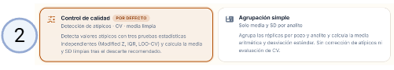
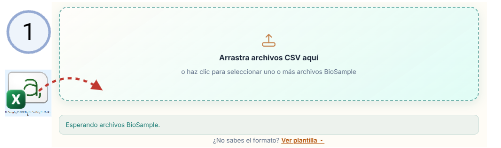
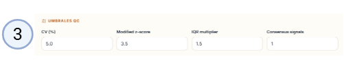
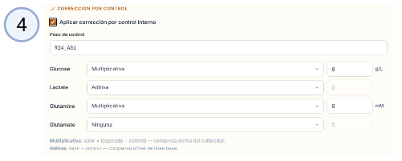

<div align="center">

# YSI Processor

### Replicate QC and control correction for YSI 2950 BioSample exports — entirely in your browser

<br>

**[→ Open the live app](https://ebalderasr.github.io/ysi-processor/)**

<br>

[]()
[]()
[]()
[](./LICENSE)
[](https://github.com/ebalderasr)

</div>

---

## What is YSI Processor?

YSI Processor is a **browser-based quality control tool for YSI 2950 BioSample exports**. Drop one or more raw `BioSample*.csv` files and get:

- replicate groups with mean, SD, and CV per well and analyte
- automated outlier detection with discard recommendations using three independent methods
- a pivot table with one row per well and one column group per analyte
- optional control-based concentration correction for each analyte
- CSV exports ready for reports or downstream analysis

It is designed for routine metabolite review in CHO and other mammalian cell culture workflows, particularly when glucose, lactate, glutamine, and glutamate readings drive feeding decisions or process tracking.

Everything runs locally in the browser. **No data ever leaves your machine.**

---

## Why it matters

YSI 2950 workflows typically involve repetitive manual work after each run:

- exporting raw CSVs and opening them in spreadsheets
- calculating mean, SD, and CV by hand for every well and analyte
- guessing which replicate caused a high CV
- applying control-based correction factors in a spreadsheet before reporting values

YSI Processor reduces that entire workflow to a single CSV drop. The core question it answers is:

**Can I trust this reading, and if not, which replicate should I re-inspect — and what is the corrected value?**

---

## How it works

Four steps. No installation. No command line.

<br>

**Step 1 — Upload your data**

Drag one or more `BioSample*.csv` files onto the drop zone or click to browse. Multiple files from the same batch are concatenated automatically. The app shows file names, row counts, and detects the column layout.



<br>

**Step 2 — Choose the analysis mode**

Two modes are available:

- **Simple grouping** — groups replicates by batch, well, and analyte, and reports mean, SD, and CV for each group. No outlier detection. Use this for a quick overview or when your replicates are already clean.
- **Quality control** — runs the full three-method outlier detection pipeline, assigns status badges (PASS · CLEANED · REVIEW · FAIL), generates the variability snapshot chart and the flagged replicates table, and unlocks the control correction feature.



<br>

**Step 3 — Configure QC parameters** *(only in Quality control mode)*

Four thresholds control how aggressively the outlier engine flags and discards replicates.



| Parameter | Default | What it does |
|---|---|---|
| **CV threshold (%)** | 5.0 | Groups whose coefficient of variation exceeds this value are flagged for review. CV = SD / mean × 100. |
| **Modified Z-Score threshold** | 3.5 | Flags individual replicates whose deviation from the group median, normalized by the MAD, exceeds this value. More robust than a standard Z-score when the distribution is skewed. |
| **IQR multiplier** | 1.5 | Controls the fence width of the IQR test. Values outside Q1 − k × IQR or Q3 + k × IQR are flagged. A larger multiplier reduces sensitivity; a smaller one increases it. |
| **Consensus signals** | 1 | Minimum number of independent flags (Modified Z, IQR, Leave-One-Out CV) a replicate must accumulate before being recommended for discard. Setting this to 2 or 3 requires agreement between methods and reduces false positives. |

A replicate is only ever recommended for discard if it is the single worst offender in its group and its removal would bring the group CV below threshold.

<br>

**Step 4 — Apply control correction** *(optional, only in Quality control mode)*

If you include a known-concentration control well in each run (e.g., a commercial standard or a house QC sample), YSI Processor can apply a post-hoc correction to every other well to compensate for instrument drift or baseline offset.



Enter the well ID of your control (default: `R24_A01`) and configure the correction type per analyte:

| Correction type | Formula | When to use |
|---|---|---|
| **Multiplicative** | corrected = value × (expected ÷ control) | Use when the instrument over- or under-reads proportionally across the measurement range — the most common form of YSI calibration drift. For example, if your glucose control reads 6.97 g/L instead of the true 6.0 g/L, every glucose reading is scaled by 6.0 / 6.97. SD is scaled by the same factor. Default for **Glucose** and **Glutamine**. |
| **Additive** | corrected = value − control | Use when the instrument has a constant baseline offset — it reads a fixed amount above or below zero regardless of the actual concentration. For example, if the lactate control (true value: 0 g/L) reads 0.15 g/L, all lactate values are shifted down by 0.15. SD is unchanged. Default for **Lactate**. |
| **None** | — | No correction applied. Default for **Glutamate**. |

When correction is enabled, a **Corrected CSV** download becomes available. It contains the same pivot table as the main summary but with corrected mean and SD columns for each analyte.

---

## Outlier detection methods

Three independent tests run on each replicate group (minimum 3 replicates required for any test):

| Test | Logic |
|---|---|
| **Modified Z-Score** | Uses median and MAD — robust to non-normal distributions. Flags if `\|0.6745 × (value − median) / MAD\|` exceeds the threshold. |
| **IQR Fence** | Flags values outside `Q1 − k × IQR` or `Q3 + k × IQR`. Only applied when IQR > 0. |
| **Leave-One-Out CV** | Removes each replicate in turn and recalculates the group CV. Flags the candidate whose removal produces the greatest CV improvement. Only applied when the group has more than 2 replicates. |

A replicate accumulates one flag per test it triggers. It is **recommended for discard** when its flag count reaches the *Consensus signals* threshold, the removal would bring the group CV below the CV threshold, and it is the single worst offender in the group. When multiple candidates qualify, the one with the highest flag score, then best CV improvement, then largest deviation from the median is chosen.

### Status labels

| Status | Meaning |
|---|---|
| **PASS** | CV below threshold, no outlier flags |
| **CLEANED** | One replicate discarded; cleaned CV now passes |
| **REVIEW** | CV above threshold but no single outlier identified |
| **FAIL** | CV above threshold even after removing the worst replicate |

---

## Features

| | |
|---|---|
| **No installation** | Runs fully client-side — no Python, no pip, no server |
| **Two analysis modes** | Simple grouping or full Quality control with outlier detection |
| **Multi-file support** | Load several plate sequences in one session |
| **Cross-plate replicate grouping** | Groups by Batch + Well + Analyte; plate sequences merged correctly |
| **Three-method outlier detection** | Modified Z-Score · IQR Fence · Leave-One-Out CV |
| **Consensus threshold** | Configurable minimum flags before a discard is recommended |
| **Pivot results table** | One row per well, column groups per analyte with units |
| **Status badges** | PASS · CLEANED · REVIEW · FAIL with color-coded rows |
| **CV chart** | Variability snapshot for the top 20 wells |
| **Copy for Excel** | Pivot table copied as tab-separated text |
| **Control correction** | Multiplicative or additive correction per analyte from an internal control well |
| **Five CSV exports** | Summary · Measurements · Outliers · Manifest · Corrected |
| **Python CLI** | Same analysis engine available as a local command-line tool |

---

## Exports

| File | Contents |
|---|---|
| `ysi_summary.csv` | One row per replicate group with raw and cleaned statistics |
| `ysi_measurements_annotated.csv` | Replicate-level QC detail with all flag scores |
| `ysi_outliers.csv` | Only the rows that triggered review or discard |
| `ysi_file_manifest.csv` | Metadata summary of the uploaded files |
| `ysi_corrected.csv` | Pivot table with control-corrected mean and SD per analyte *(only when correction is enabled)* |

---

## Input format

### Required columns

| Column | Accepted aliases | Description |
|---|---|---|
| `PlateSequenceName` | `PlateName`, `PlateID` | Plate run identifier |
| `BatchName` | `Batch`, `BatchID` | Experiment batch name |
| `WellId` | `WellID`, `Well`, `Position` | Sample position |
| `ChemistryId` | `ChemistryID`, `Chemistry`, `Analyte` | Analyte name |
| `Concentration` | `Result`, `Value` | Measured value |

### Optional columns

| Column | Accepted aliases | Use |
|---|---|---|
| `CompletionState` | `Status`, `ResultState` | If present, only `Complete` rows are used |
| `Units` | `Unit`, `MeasurementUnits` | Displayed in analyte column headers |
| `LocalCompletionTime` | `DateTime`, `Timestamp` | Used for replicate ordering and included in exports |
| `Errors` | `Error`, `ErrorMessage` | Included in the file manifest |
| `SampleSequenceName` | `SampleName`, `SampleId` | Included in summary exports |

### Typical YSI 2950 export header

```
PlateSequenceName, BatchName, LocalCompletionTime, CompletionState,
WellId, ChemistryId, ProbeId, Concentration, Units, Endpoint,
SampleSize, InitialBaseline, Plateau, FinalBaseline, NetPlateau,
NetPlateauTempAdj, CrossNetPlateau, CrossNetPlateauTempAdj,
PlateauSlope, Temperature, Errors
```

---

## Python CLI

The `ysi_toolkit` package provides a full Python backend with the same analysis logic. Useful for batch processing, integration into pipelines, or running from scripts.

**Requirements**

```bash
pip install -r requirements.txt
```

**Basic usage**

```bash
python ysi_processor.py --input ./data --output ./results
```

**All options**

```
--input              Directory with BioSample*.csv files  (default: current dir)
--output             Directory for output files            (default: current dir)
--cv                 CV threshold for review               (default: 5.0)
--modified-z         Modified z-score threshold            (default: 3.5)
--iqr-multiplier     IQR fence multiplier                  (default: 1.5)
--consensus-min-flags  Minimum flags to recommend discard  (default: 1)
--verbose            Enable debug logging
```

**Example**

```bash
python ysi_processor.py \
  --input ./20260317-T6 \
  --output ./results \
  --cv 5.0 \
  --modified-z 3.5 \
  --verbose
```

**Outputs**

```
results/
├── ysi_summary.csv
├── ysi_measurements_annotated.csv
├── ysi_outliers.csv
├── ysi_file_manifest.csv
├── ysi_quality_report.html
├── ysi_cv_overview.png
└── ysi_flagged_replicates.png
```

---

## Author

**Emiliano Balderas Ramírez**
Bioengineer · PhD Candidate in Biochemical Sciences
Instituto de Biotecnología (IBt), UNAM

[](https://www.linkedin.com/in/emilianobalderas/)
[](mailto:ebalderas@live.com.mx)

---

## Related — HostCell Lab Suite

[**Clonalyzer 2**](https://github.com/ebalderasr/Clonalyzer-2) — fed-batch kinetics analysis for CHO cell cultures.

[**PulseGrowth**](https://github.com/ebalderasr/PulseGrowth) — growth kinetics and process timing for mammalian cell culture.

[**CellSplit**](https://github.com/ebalderasr/CellSplit) — passage planning and split calculations for adherent cell culture.

---

<div align="center"><i>YSI Processor — drop your BioSample CSV, get your replicate QC.</i></div>
